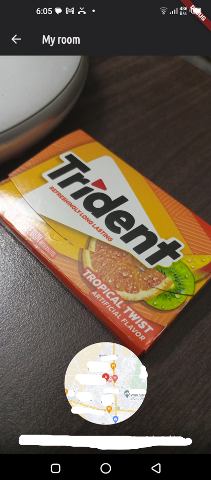

# Favorite Places App

This Flutter project is a guided project inspired by Maximilian Schwarzmüller's Udemy Course: [Learn Flutter & Dart to Build iOS & Android Apps](https://www.udemy.com/course/learn-flutter-dart-to-build-ios-android-apps/).

The purpose of this project was to get familiar with native device features, such as Camera, GPS, and Storage. In the course, you'll learn how to create a mobile app that allows users to save their favorite places by taking pictures, adding titles, and recording the location.

## Project Features

- Apply state management using the Riverpod library.
- Capture and save favorite places with images.
- Retrieve the user's current location using GPS.
- Utilize Google Maps API to display maps and location addresses.
- Save data to the device's local storage.

## Project Structure

The project's file structure looks like this:
```
favorite_places:
    assets:
        .env
    lib:
        models:
            place.dart
        providers:
            places_provider.dart
        screens:
            add_place.dart
            map.dart
            place_details.dart
            places.dart
        widgets:
            image_input.dart
            location_input.dart
            places_list.dart
        main.dart
    pubspec.yaml
    README.md
```

## Screenshots

### Home Screen


The Home Screen displays a list of favorite places that the user has saved. Users can tap on a place to view its details.

<!--  -->


### Add Place Screen

The Add Place Screen allows users to add a new favorite place. Users can enter a place name, take a picture, and select the location either manually on the map or by using the device's GPS.

<!--  -->


### Place Details Screen

The Place Details Screen displays the details of a saved place, including its name, image, address, and a map showing the location. Users can tap on the map to view it in a larger size.

<!--  -->


### Map Screen

The Map Screen displays a map with a marker at the user's current location. Users can also tap on the map to select a location.

<!--  -->


## Packages Used

### [flutter_riverpod](https://pub.dev/packages/flutter_riverpod)

Flutter Riverpod is a state management library used to manage the app's state in a modular and testable way. It was used to manage the list of favorite places. Below is an example of how it was used:

```dart
class FavoritePlacesNotifier extends StateNotifier<List<Place>> {
  FavoritePlacesNotifier() : super([]);

  // ...

  void addFavoritePlace(String name, File img, PlaceLocation location) async {
    // ...

    final db = await getDatabase();
    db.insert('user_places', {
      'id': place.id,
      'title': place.name,
      'image': place.img.path,
      'lat': place.location.latitude,
      'lng': place.location.longitude,
      'address': place.location.address,
    });
    
    state = [...state, place];
  }

  // ...
}
```

### [image_picker](https://pub.dev/packages/image_picker)
The image_picker package was used to capture images from the device's camera. Here's an example of its usage:
```dart
void _takePicture() async {
  final img = await ImagePicker().pickImage(
    source: ImageSource.camera,
    maxWidth: double.infinity,
    maxHeight: double.infinity,
  );

  // ...
}
```
### [location](https://pub.dev/packages/location)
The location package was used to retrieve the device's current location. Here's an example of its usage:
```dart
void getCurrentLocation() async {
  Location location = Location();

  // Check if location services are enabled and request permission if needed

  locationData = await location.getLocation();
  final lat = locationData.latitude;
  final lng = locationData.longitude;

  saveLocation(lat, lng);
}
```

### [google_maps_flutter](https://pub.dev/packages/google_maps_flutter)
```dart
GoogleMap(
  initialCameraPosition: CameraPosition(
    target: ...
    zoom: 16,
  ),
  onTap: ...,
  markers: {...},
)
```

## Getting Started

Before you start using the project, make sure to replace the placeholder Google Maps API Key in the `.env` file with your own API key obtained from Google Cloud. (You can get one [here](https://developers.google.com/maps/documentation/android-sdk/get-api-key).)

```dotenv
GOOGLE_MAPS_API_KEY='your_api_key_here'
```

Also, see the packages documentation to adjust your Android and iOS projects accordingly.

# INSTALLATION
1. Clone this repository to your local machine:
```bash
git clone https://github.com/khayyam-ahmed/favorite_places.git
```
2. Create a .env file in the assets folder and add you API key.
3. Run the app on your device or emulator:
```bash
flutter pub get
flutter run
```

# Credits
This project is based on the tutorial by Maximilian Schwarzmüller and was created as a learning exercise in Flutter, Dart, Riverpod state management and Google Cloud Console.

